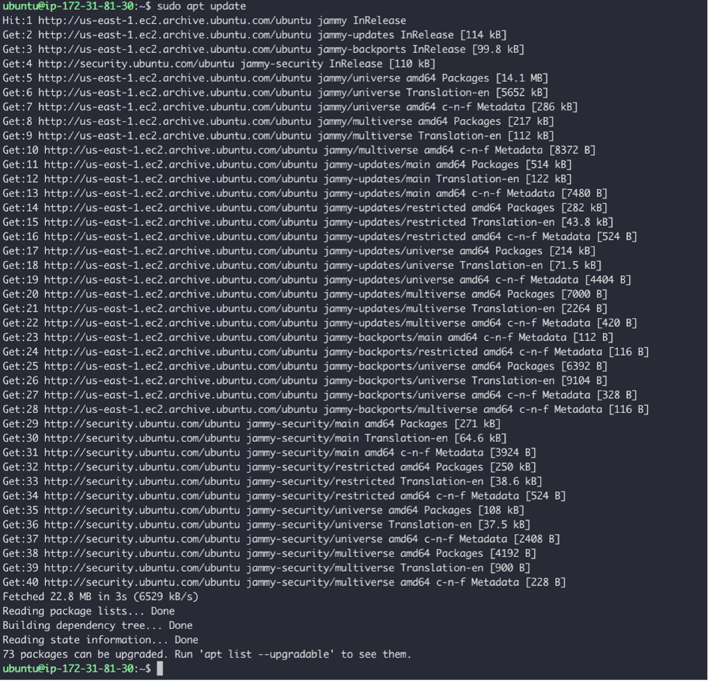
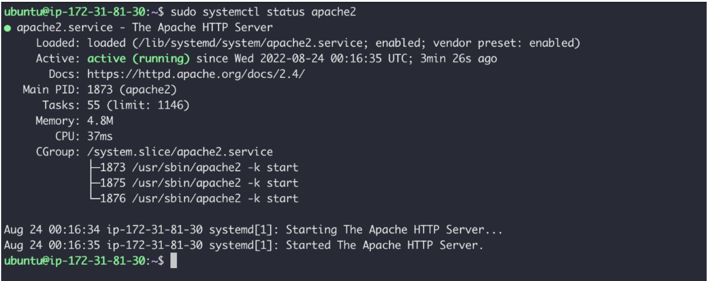
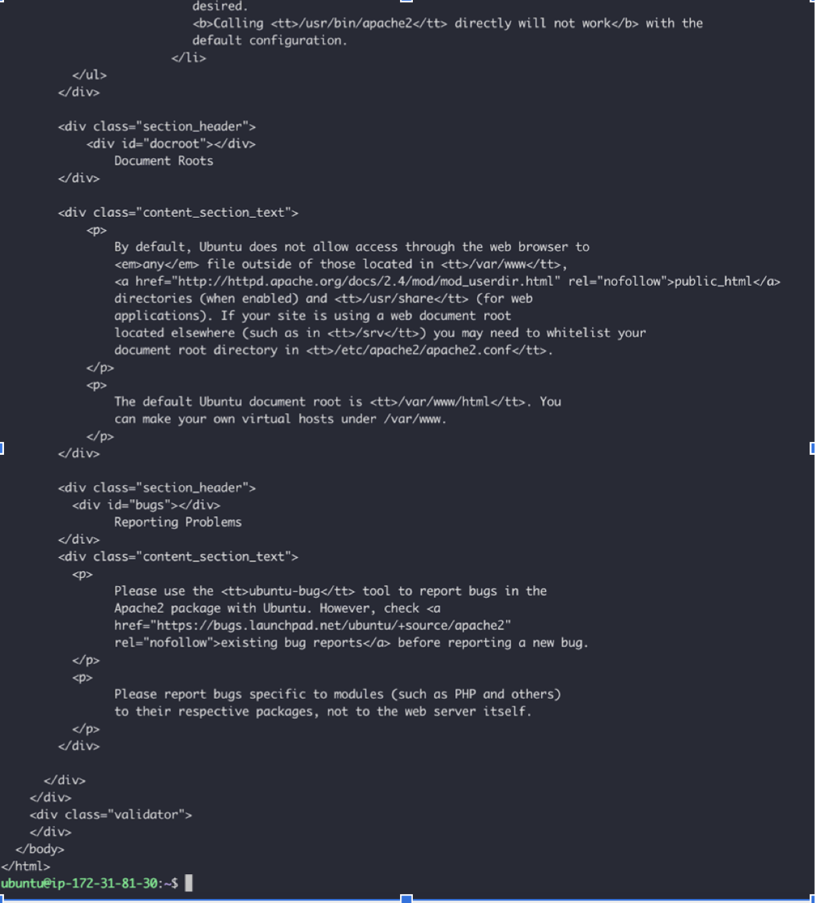
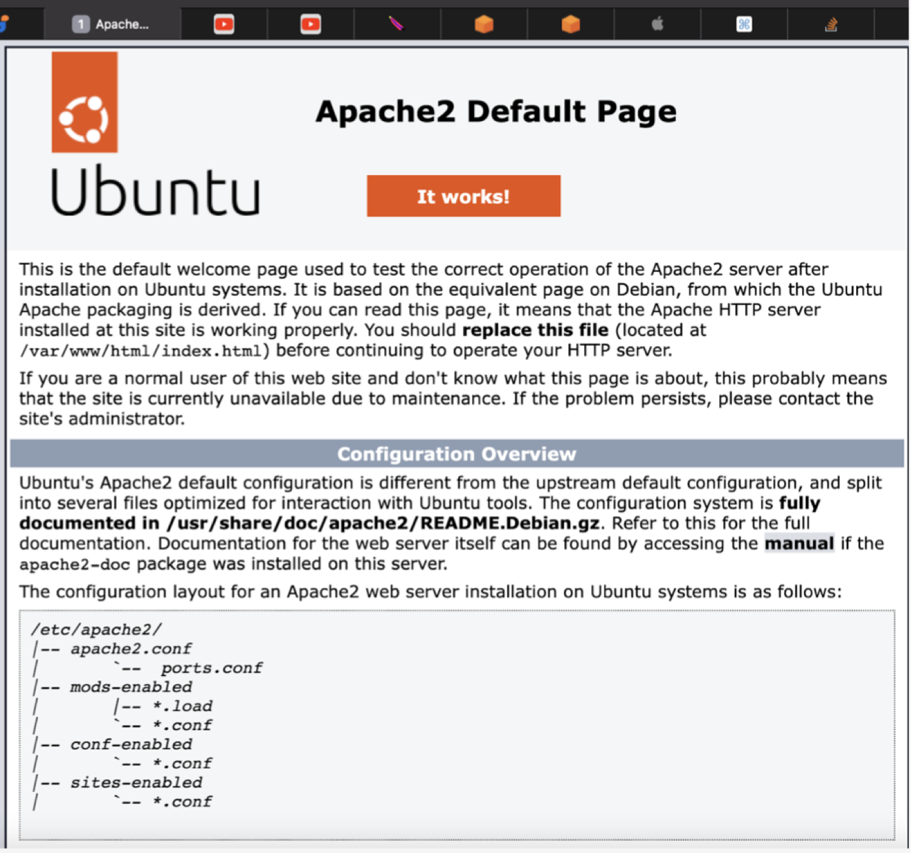
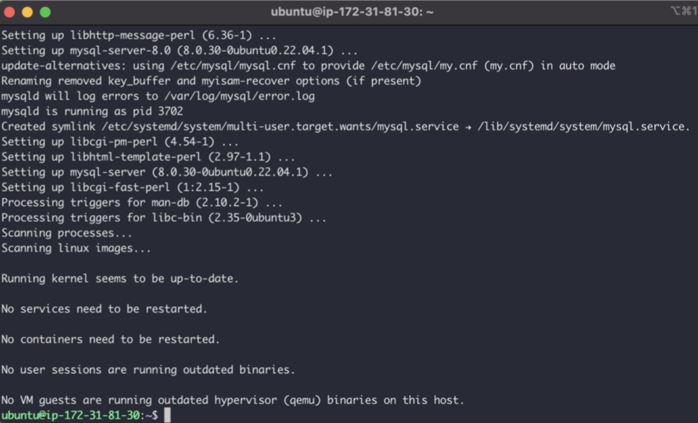
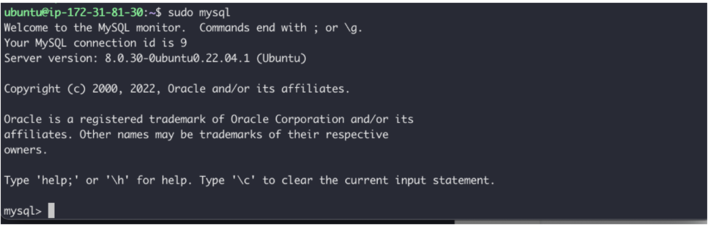
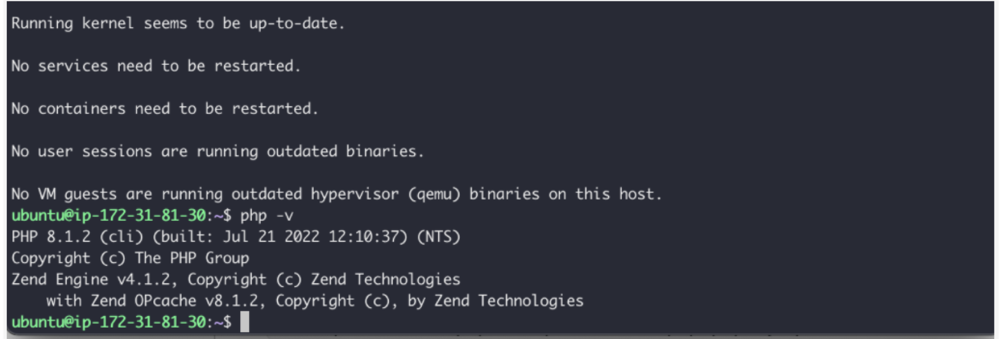
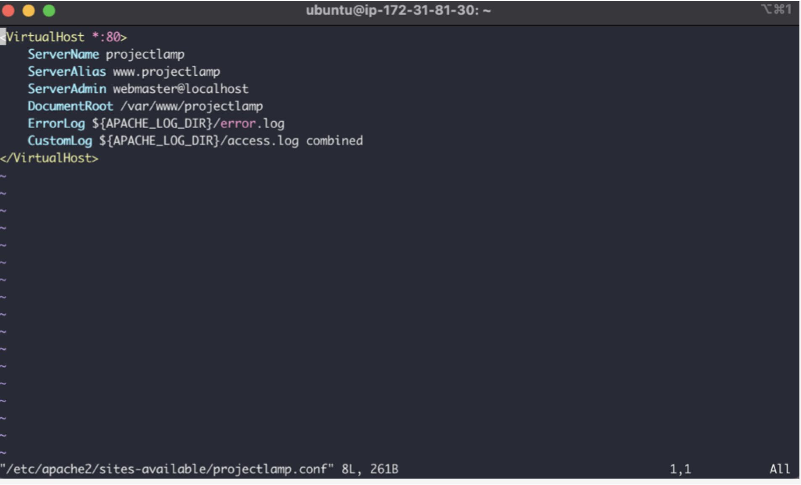
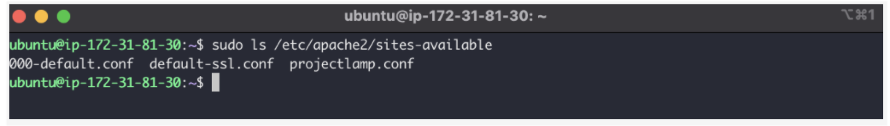
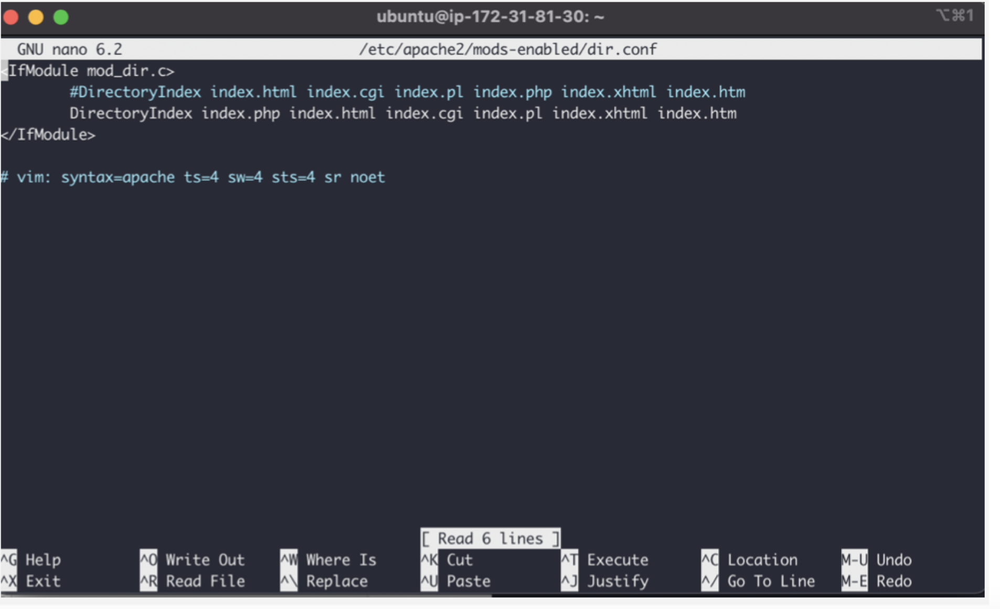

## Project1 Documentation

### STEP 1 — INSTALLING APACHE AND UPDATING THE FIREWALL
`sudo apt update`

`sudo apt install apache2`

`sudo systemctl status apache2`

`curl http://localhost:80`

### STEP 2 — INSTALLING MYSQL

`sudo apt install mysql-server`

`sudo mysql`

### STEP 3 — INSTALLING PHP

`sudo apt install php libapache2-mod-php php-mysql
php -v`

### STEP 4 — CREATING A VIRTUAL HOST FOR YOUR WEBSITE USING APACHE

`sudo mkdir /var/www/projectlamp`

`sudo nano /etc/apache2/sites-available/projectlamp.conf`

`sudo ls /etc/apache2/sites-available`

### STEP 5 — ENABLE PHP ON THE WEBSITE

`sudo nano /etc/apache2/mods-enabled/dir.conf`

`nano /var/www/projectlamp/index.php`
